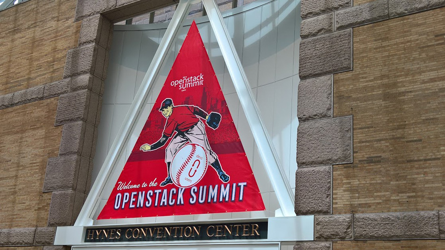
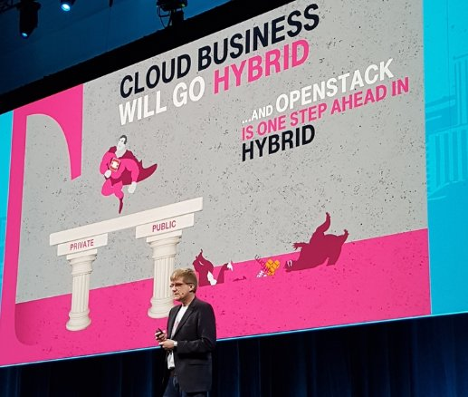
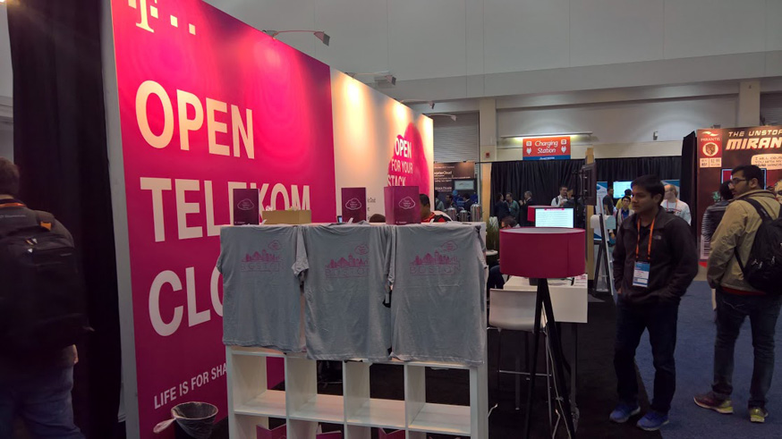
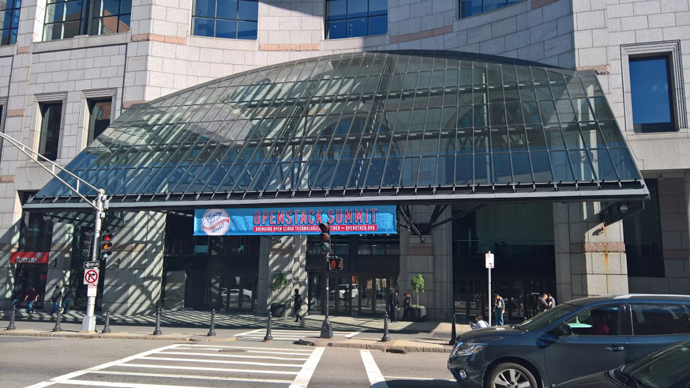
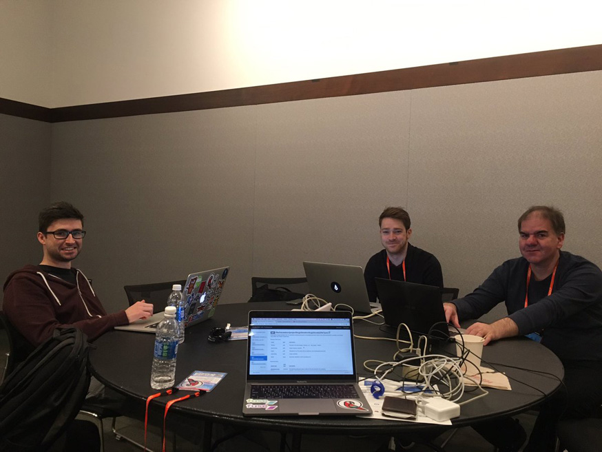
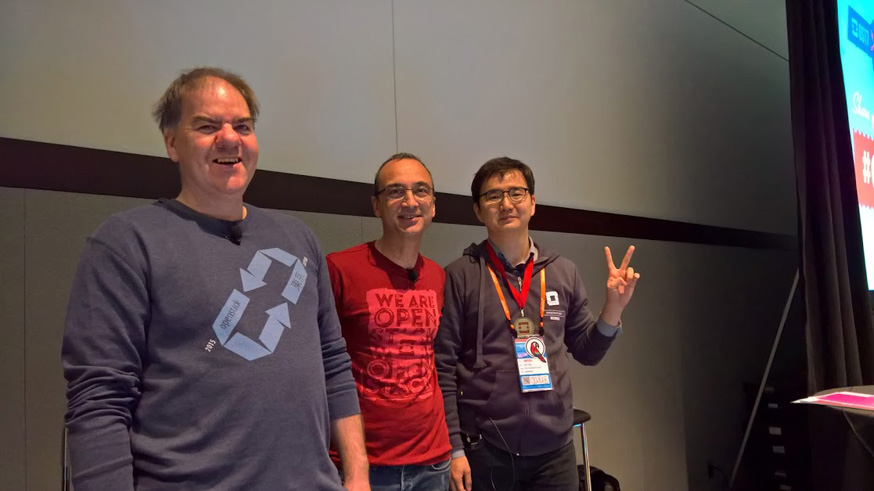
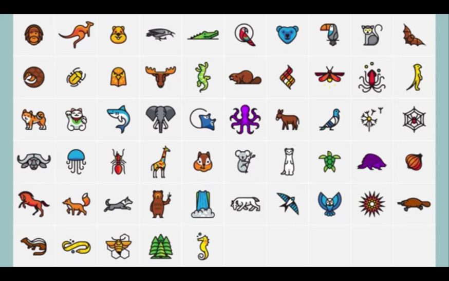
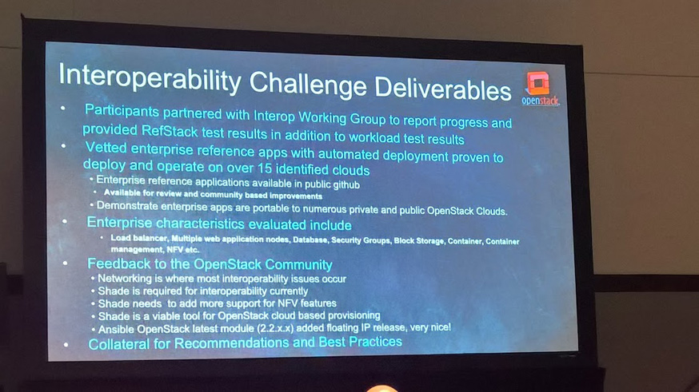
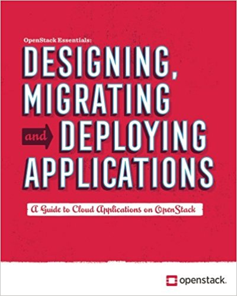

OpenStack Summit Boston



Một OpenStack Summit kiểu mới vừa kết thúc cách đây ít ngày tại Boston. Đối với những ai chưa biết thì trước đây cộng đồng OpenStack chỉ có duy nhất Design Summit. Tại Design Summit, các nhà phát triển trong cộng đồng sẽ tập trung lên ý tưởng cũng như yêu cầu cho các bản phát hành tiếp theo. Họ cùng nhau bàn bạc về những chi tiết trong khâu vận hành đồng thời đó cũng là cách để gắn kết các thành viên lại với nhau. Thông thường hiệp hội OpenStack Foundation sẽ có những sự tài trợ nhất định về chi phí đi lại cho những người tham gia. Design Summit lần cuối cùng là vào tháng 10/2016 tại Barcelona cho phiên bản Ocata.

Design Summit giờ đây đã được chia nhỏ ra thành 2 sự kiện riêng biệt. Một là   Project Team Gatering (PTG) diễn ra trước đó vài tuần tại Atlanta. Định kì 6 tháng 1 lần, các project teams sẽ tụ họp lại để thảo luận cũng như đưa ra giải pháp một cách nhanh chóng nhất cho phiên bản tiếp theo. Sự kiện còn lại chính là OpenStack Summit, đây là nơi các góp ý cũng như những yêu cầu từ người dùng được lắng nghe và đồng thời đây cũng là dịp để toàn bộ cộng đồng cùng thảo luận về một vấn đề nào đó.

Có vài ý kiến cho rằng OpenStack Summit thực chất chỉ mang tính chất quảng bá. Tuy nhiên giám đốc điều hành của OpenStack Foundation - Jonathan Bryce lại không cho là như vậy. Ông cho rằng hội nghị này đã đang và sẽ dành cho những người thực sự quan tâm, những nhà phát triển của OpenStack. Và sự thật đã cho thấy rằng điều ấy hoàn toàn đúng đắn khi có tới hơn 1000 tổ chức và 5000 người từ 63 quốc gia trên toàn thế giới đã tới tham dự OpenStack Summit vừa rồi.

Deutsche Telekom trong lần thứ 2 trở thành nhà tài trợ Vàng:





Nếu được hỏi cảm nhận về OpenStack Summit đầu tháng 5 vừa rồi thì có lẽ rất nhiều người sẽ nhận định rằng tham dự hội nghị lần này khá ...đắt đỏ. Đây là sự thật bởi nó được tổ chức ở một thành phố nổi tiếng về mức độ tiêu tiền ở Mỹ khi giá trung bình của một khách sạn lên tới 300-500 đô la cho một đêm. Phần lớn thời gian của hội nghị diễn ra tại Hynes Convention Center. Tòa nhà này được bao quanh bởi 4 khách sạn lớn và chúng đều được kết nối với nhau.



Toàn bộ các bài thuyết trình có thể được tìm thấy trên Youtube hoặc trang chủ của OpenStack:

https://www.openstack.org/videos/summits/boston-2017

Điểm đáng chú ý đầu tiên của hội nghị lần này tất nhiên là những phần phát biểu quan trọng:

https://www.openstack.org/videos/boston-2017/tracks/keynotes

OpenStack đã phát triển rất nhiều trong năm vừa qua. Theo thống kê mới nhất, số lượng người dùng đã tăng 44% và hơn 5 triệu CPU đang được quản lí bởi OpenStack. Chúng ta đang tiến tới thế hệ thứ 2 của Private Cloud. Thế hệ thứ nhất - Hyperscale Cloud vẫn đang có được những thành công nhất định. VMWare, Eucalypthus, CloudStack rồi OpenStack đã được sử dụng cho ảo hóa. Ở thế hệ thứ 2 của Private Cloud, mọi thứ giờ đây đều đã được ảo hóa bao gồm: networks, storage, containers, bare metal.

Điểm nhấn đó chính là OpenStack, Cloud Foundy, Kubernetes và Mesos. Những công nghệ này hướng nhiều hơn đến tương lai và quá trình phát triển. Rõ ràng công nghệ thời điểm này cần phải trở lên đơn giản để ngay cả những công ty nhỏ cũng có thể triển khai OpenStack. Càng cắt giảm được nhiều chi phí thì lợi ích mà nó mang lại sẽ càng lớn.

Không có quá nhiều nất ngờ khi mà trong bài phát biểu của mình, Jonathan Bryce  đã mời lên sân sân khấu 2 thành viên trong cộng đồng, những người đã chú ý lắng nghe từ đầu đến cuối. OpenStack không phải cho mục đích cá nhân. Có rất nhiều các projects khác ngoài "top 10" core projects, đó cũng là một phần của OpenStack. Câu hỏi đặt ra là điều gì sẽ xảy đến khi mà OpenStack được triển khai. Sau đây là thông kê về các tools chạy trên OpenStack:


``` sh
45 % Kubernetes
18 % OpenShift
18 % CloudFoundry
17 % Build our own
14 % Mesos
14 % Docker Swarm
17 % Andere
```

Số liệu này được lấy từ những bản khảo sát trong ngày hội mã nguồn mở ( OpenSource Days) tổ chức song song với OpenStack Summit. Có lẽ số đông fan của các softwares như Ansible hay Ceph đều đã rất thất vọng bởi họ thậm chí không có tên trong danh sách. Chỉ có duy nhất Kubernetes không làm người hâm mộ thất vọng khi xuất hiện trong hầu hết các phiên bàn bạc tại hội nghị.

Mặc dù vậy, cá nhân tôi vẫn chú ý nhiều hơn vào Ansible và ứng dụng Translation Check Site của họ.

https://review.openstack.org/#/c/440825/

Và tôi cũng đã gặp Ian Y. Choi (PTL I18n), Rob Cresswell (PTL Horizon) và Andy McCrae (PTL OSA) tại hội nghi để bàn về kế hoạch cho một cuộc chiến thực sự. 



Andy thực sự rất thông minh. Anh ấy luôn biết cách giải quyết các vấn đề để dự án kịp tiến độ.
Trong một vài phiên họp, anh đấy cũng thuyết trình về project và những điều cần phải hoàn thành trong tương lai gần:

<iframe  title="YouTube video player" width="480" height="390" src="https://youtu.be/QCmSHSaah3Y" frameborder="0" allowfullscreen></iframe>

https://youtu.be/UUe96OmCCug

OpenStack Forum là một sự kiện mới của OpenStack Summit lần này. Trong 10 "hackrooms" khác nhau, các nhà phát triển đã đưa ra và cùng bàn bạc về những vấn đề hiện tại. Một điểm mới nữa đó là phiên OnBoarding. Các dự án có cơ hội kết nạp thêm thành viên mới tại đây. 

Cộng đồng OpenStack được tạo ra để liên tục phát triển. Có rất nhiều người từ Đức cũng đã đến tham dự hội nghị và trong danh sách những quốc gia có số lượng người tham gia đông nhất, chúng ta xếp thứ 6 (tác giả là người Đức). Trong danh sách những quốc gia sử dụng tài liệu về OpenStack nhiều nhất thì đức xếp thứ 7, sau Anh, Trung Quốc, Nhật Bản, Pháp và Hàn Quốc. Các thống kê này được cung cấp bởi Alexandra Settle, PTL Documentation Team tại Teammeeting của I18n.


Với tốc độ phát triển như hiện tại thì rất có thể Đức sẽ là một địa điểm khá phù hợp để tổ chức OpenStack Summit lần sau.
Trong cùng ngày, chúng tôi cũng có bài thuyết trình về "Participating in Translation Makes You an Internationalized OpenStacker and Developer":

https://www.openstack.org/videos/boston-2017/participating-in-translation-makes-you-an-internationalized-openstacker-and-developer



Ian Y. Choi, Jean-François Taltavull, Frank Kloeker (f.r.t.l.)

Để mọi người hiểu thêm về những gì team I18n đang làm, có hẳn một tutorial hướng dẫn về việc tham gia đóng góp cũng như biên dịch OpenStack sang ngôn ngữ bản địa.

Bên cạnh đó, ở hội nghị lần này, một loạt các "linh vật của projects" đã được ra mắt.

https://www.openstack.org/project-mascots/

Tại Foundation Lounge, có rất nhiều những sticker đi kèm với "linh vật" của từng project. Người dùng giờ đây có thể dễ dàng nhận ra các project teams từ logo của họ.



Ở một vài sự án khác, có một số sessions đã phải có những sự updates do những vấn đề không mong muốn phát sinh:

https://www.youtube.com/user/OpenStackFoundation/search?query=Project+Update&sp=CAI

Với Interop Challenge lần thứ hai, nhóm dự án Interop đã có thể đặt mình ở vị trí đặc biệt tốt. Tuy nhiên, Mark Collier lại một lần nữa xuất hiện với một số "bad things" làm cho cloud của team không thể hoạt động một các "trơn tru" được nữa.



https://youtu.be/nBXXLNIwAoo

https://youtu.be/Xo22mqWM4Xo

Nếu bạn có hứng thú với InterOps, bạn có thể xem thêm thông tin tại :

https://wiki.openstack.org/wiki/Interop_Challenge

Một bài thuyết trình đáng chú ý khác đó là  Monty Taylor với chủ đề Python Shade:

https://youtu.be/Z4gnNdk5GQY

Slide: http://inaugust.com/talks/everything-you-ever-wanted.html#/

Trong session của Taylor, anh ấy đã cho chúng ta thấy kết nối server-to-server hoạt động ra sao trong OpenStack và làm thế nào để mở rộng PythonShade.

**Một vài dấu ấn thú vị khác**

Remotely managed Private Cloud
https://www.openstack.org/marketplace/remotely-managed-private-clouds/

Một kiểu mới của dịch vụ cloud cung cấp khả năng quản lí từ xa Private Cloud.
Một điều khác cũng rất đáng chú ý: ** Edge OpenStack** , đó là các instances cho IoT, AR/VR/Drones cho khoảng hơn 20 data center/availabilty zones. Lí do đơn giản đó là đỗ trễ cũng như dung lượng lưu trữ chắc chắn sẽ thay đổi trong tương lai gần.

Beth Cohen từ Verizon đã trình bày về các use cases của Edge Computing:

https://www.openstack.org/videos/boston-2017/taking-openstack-out-to-the-network-edges
https://www.youtube.com/watch?v=WbeLMhcrkz8

The OTC team đã trình bày về một số vấn đề về tự nhiên:

Image Build as a Service- Why It Makes Sense to Build Your Own Cloud Images

https://www.openstack.org/videos/boston-2017/image-build-as-a-service-why-it-makes-sense-to-build-your-own-cloud-images

Dĩ nhiên bạn có thể triển khai ứng dụng của mình từ một image Ubuntu mà không có cloud-init, Puppet hoặc Ansible. Tuy nhiên việc ấy sẽ tốn khá nhiều thời gian. Với những image được cấu hình sẵn, bạn có thể triển khai dễ dàng hơn rất nhiều.

Có rất nhiều thứ có thể học được tại OpenStack Summit. Linux Academy đã offer một khóa training cho những người tham dự từ đầu đến cuối.  Certified OpenStack Administrator cũng được đưa ra bàn luận, đây là chứng chỉ đầu tiên của OpenStack được ra mắt vào năm 2016. Đã có hẳn một phiên họp được giành riêng để nói về những tips giúp người dùng vượt qua bài test:

https://youtu.be/G_JDLt2vDgY

Vào cuối buổi, cuốn sách "Designing, Migrating and Deploying Applications" được ra mắt và mọi người có thể download nó tại :

https://www.openstack.org/assets/enterprise/OpenStack-AppDevMigration8x10Booklet-v10-online.pdf

Những điều được viết trong cuốn sách này sẽ là thứ được bàn bạc trong OpenStack Summit lần sau.



--------------------------
Links:

Session-List: https://www.openstack.org/summit/boston-2017/summit-schedule
Recap Superuser-Magazine: http://superuser.openstack.org/articles/openstack-summit-boston-recap-post/
My Youtube Playlist: https://www.youtube.com/playlist?list=PLBYczRi39Ez77U-CBKfD7pMwtL9_p3_5f

**Link bài gốc:**

http://blog.eumelnet.de/blogs/blog8.php/openstack-summit-boston?page=2